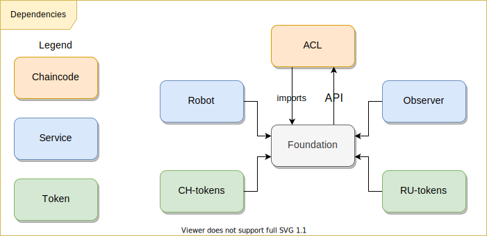

# Versioning

Описание процесса версионирования Foundation

## TOC

- [Versioning](#versioning)
  - [TOC](#toc)
  - [Description](#description)
  - [Versioning process](#versioning-process)
      - [Patch](#patch)
      - [Minor](#minor)
      - [Major](#major)
        - [ACL](#acl)
  - [Components dependent on the foundation](#components-dependent-on-the-foundation)
  - [Backport and LTS](#backport-and-lts)
  - [Links](#links)


## Description

* В проекте используется [корпоративный стандарт версионирования(semver)](https://gitlab.n-t.io/core/doc/-/blob/master/versioning/index.md)
* Версионирование осуществляется с помощью тегов вида **vA.B.C** 
  - v1.0.0
  - v2.0.1
  - v3.1.1
  - v4.5.6

* Для LTS релизов создаются долгоживущие ветки вида **vA**
 - v1
 - v2
 - v3
 - v4

* Рефсы ниже считются protected

```
v*.*.*
```

```
v*
```

## Versioning process

Описание процесса версионирования  
Правки в библиотеку могут быть 3-х типов:
  - patch
  - minor
  - major

Примеры классификации изменений:

* Внесены несовместимые изменения в API. В структурах **ChainCode,
  BaseContract, BaseContractInterface** или **BaseToken** удалены
  публичные методы, изменилась сигнатура публичных методов: изменены
  названия публичных методов, изменилось количество аргументов
  методов, изменены аргументы методов или были внесены изменения в
  типы аргументов методов или в возвращаемый результат; (#major)

* Внесены несовместимые изменения в выполнение базовых функций -
  **swap, multiswap, batchExecute, nonce, Chaincode.Init,
  Chaincode.Invoke** для существующих методов. Это требует изменений в
  зависимых компонентах, таких, как **robot** и **observer**; (#major)

* Внесены несовместимые изменения **chaincode events** для
  существующих методов Это требует изменений в зависимых компонентах, 
  таких как **robot** и **observer**. (#major)

* Изменены названия публичных полей или методов в публичных структурах, 
  proto-файлах, или же какие-либо поля/методы **удалены**. (#major)

* Изменены названия публичных полей или методов в публичных структурах, 
  proto-файлах, или же какие-либо поля/методы **добавлены**. (#minor) 

* Исправление бага в функции, которые не изменяют входные параметры и возвращаемые значения. (#patch) 

* Добавление приватной структуры или приватной функции (#patch)

* Изменение и удаление сообщений об ошибках (#minor)

* Добавление новых сообщений об ошибках (#patch)

На данный момент существует циклическая зависимость с чейнкодом ACL.  
ACL через импорт использует proto и типы foundation, a foundation зависит от ACL через его API.  



ACL версионируется независимо от foundation и в общем случае не привязан к последней версии foundation. Т.к. в foundation major правки чаще всего не затрагивают логику работы c ACL.  

#### Patch

Процесс выпуска версии с исправлением багов описывается шагами

* создание ветки вида `{{issue_number}}-{{short_subject}}`

```
1234-fix-bug-with-calculating-fee
```

* доработка или создание unit теста на выявление ошибки
* внесение исправляющих изменений
* принудительный запуск интеграционного тестирования в ветке
* подготовка MR в основную ветку
* для создания релизного тега необходимо изменить RELEASE NOTES (MR/commit в master) и создать релизный тег только после прохождения пайплайна
* допускается создание нового patch релиза с несколькими независимыми исправлениями
* уведомить о выходе версии коллег (в слак, канал @core-all)

#### Minor

Процесс выпуска версии с добавлением новой функциональности

* создание ветки вида `{{issue_number}}-{{short_subject}}`

```
1234-new-feature-with-multi-emission
```

* разработка нового функционала
* создание unit тестов покрывающих новый функционал
* создание интеграционных тестов покрывающих новый функционал
* принудительный запуск интеграционного тестирования в ветке
* подготовка MR в основную ветку
* для создания релизного тега необходимо изменить RELEASE NOTES (MR/commit в master) и создать релизный тег только после прохождения пайплайна
* на любой новый функционал выпускается новый тег с измененной minor версией, объединение нескольких фичей в один релиз **недопустимо**
* уведомить о выходе версии коллег (в слак, канал `@core-all`)

#### Major

Процесс выпуска новой версии с несовместимыми изменениями.  

**ВАЖНО** при разработке нового функционала всегда нужно стараться сохранить обратную совместимость.

* при разработке нового функционала выявлено нарушение обратной совместимости
* создание временной ветки,`tmp-v{{A}}`

```
tmp-v4
```

* слияние всех веток, дающих новый функционал и приводящих к потере обратной совместимости в общую ветку
* создание unit тестов покрывающих новый функционал
* создание интеграционных тестов покрывающих новый функционал
* принудительный запуск интеграционного тестирования в долгоживущей ветке
* подготовка MR в основную ветку
* для создания релизного тега необходимо изменить RELEASE NOTES (MR/commit в master) и создать релизный тег только после прохождения пайплайна
* перед внесением обратно несовместимых изменений необходимо убедиться, что иначе эти изменения никак не внести, утвердить это с мейнтейнером проекта Foundation 
* уведомить о выходе версии коллег и стейхолдеров (в слак, каналы `@core-all` и `@core-support-*`)

##### ACL

* ** Изменения Foundation, которые затрагивают API ACL должны быть обратно совместимы **
* Изменения затрагивающие API acl предварительно должны быть согласованы на арх. ком.

Краткое описание действий при изменении API ACL:

- ACL - создание LTS версий
- ACL - выпуск новой мажорной версии
- foundation - выпуск новой версии
- ACL - создание новой ветки с обновленным go.mod, зависимостями, доработками в методы
- внесение правок в зависимые сервисы
- пересборка всех чейнкодов заказчиков
- редеплой всех чейнкодов заказчика


## Components dependent on the foundation

Компоненты зависимые от foundation

При выпуске major релизов стоит учитывать зависимые компоненты

* [чейнкоды RU](https://gitlab.n-t.io/atmz/atomyze-ru) 
* [робот](https://gitlab.n-t.io/core/application/off-chain/robot)
* [старый обзервер](https://gitlab.n-t.io/atmz/observer)
* [de-atomyzer](https://gitlab.n-t.io/core/library/hlf-tool/de-atomyzer)
* [hlf-cache](https://gitlab.n-t.io/core/application/off-chain/hlf-cache)
* [explorer](https://gitlab.n-t.io/core/application/off-chain/explorer) - использует через прямое копирование кода 

Можно получить детальный список с помощью глобального поиска и утилиты `gitgit`

## Backport and LTS

Возможна ситуация, когда у заказчика на стендах находится версия чейнкодов с не самой свежей версией Foundation и при этом ему требуется получить новый функционал Foundation

Для этого используется механика веток LTS и бэкпортирования изменений. 
По договоренности с заказчиками время жизни LTS-ветки - 6 месяцев с момента проставления тега мажорной версии.
LTS-ветки имеют вид `v{{A}}`  
  - v1
  - v2
  - v3

Последовательность действий:

* разработка нового функционала (действия из [minor](#minor))  
  при слиянии MR не нужно удалять ветку с новым функционалом
* определение версии Foundation у заказчика и создание LTS ветки с этой версией в репозитории Foundation  
  ветка LTS уже может быть в репозитории
* принудительный запуск интеграционного тестирования в ветке LTS
* подготовить MR слияния ветки с новым функционалом с веткой LTS
  возможно наличие обратно несовместимых изменений в ACL, [подробности тут](#acl)
* для создания релизного тега необходимо изменить RELEASE NOTES (MR/commit в LST-ветку) и создать релизный тег только после прохождения пайплайна
* уведомить о выходе версии коллег и заказчика (в слак, каналы `@core-all` и `@core-support-<stakeholder>`)

## Links

* no